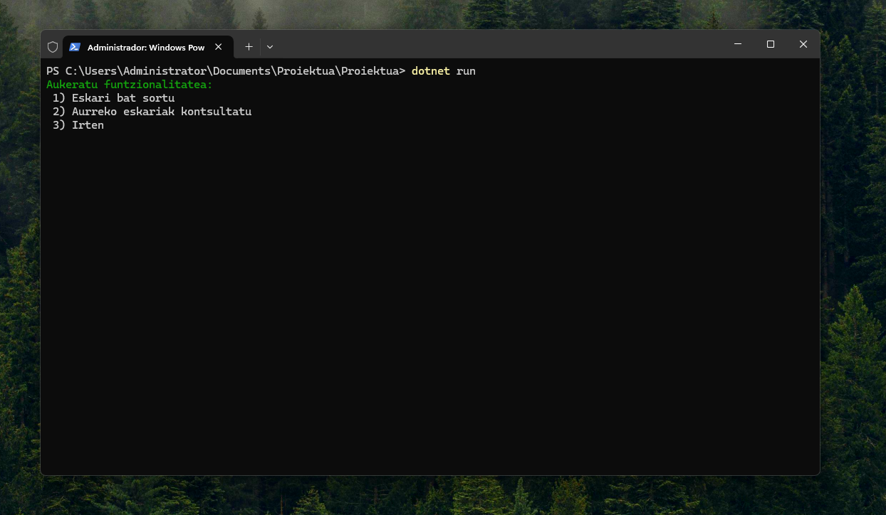

# Eskaerak egiteko Menua



[](https://wakatime.com/badge/user/a79b1042-0281-4db8-aeb2-8329a335b1a9/project/ad3f76dd-5573-43b2-9c73-bc92acdf0239)

Nire kasuan jatexte baten eskaera menua egin behar nuen, hona hemen proiektua.
---

## 🛠 Teknologiak

Proiektu honek honako hauek erabiltzen ditu:

- [C#](https://learn.microsoft.com/dotnet/csharp/)
- [.NET](https://dotnet.microsoft.com/)

---

## 💻 Instalazioa

Proiektua zure makinako ingurunean martxan jartzeko, jarraitu pauso hauek:

```bash
# Biltegia klonatu
git clone https://github.com/iviscaralv-svg/programazio-proiektua.git

# Direktorioan sartu
cd programazio-proiektua

# Proiektua eraiki
dotnet build

# Proiektua exekutatu
dotnet run

